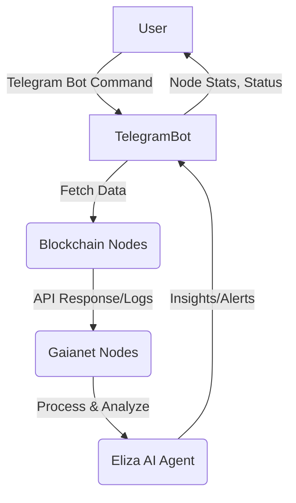

# 🌐 Intelligent Node Analyzer - Telegram Bot (Gaia Autonomous AI Hackathon project)

A cutting-edge solution to monitor and analyze blockchain nodes running on VPS servers. Powered by the Gaianet LLM engine and Eliza AI agent framework, this Telegram bot provides real-time insights into node health, performance, and other vital statistics, all wrapped in an intuitive and autonomous AI-powered interface.

---

## 🚀 Features

- **Node Status and Statistics**  
  Retrieve and analyze the health, uptime, transaction throughput, and error logs of blockchain nodes in real-time.  
- **Multi-Blockchain Compatibility**  
  Supports various blockchain protocols like Ethereum, Polygon, Solana, Tezos, and more.  
- **AI-Powered Insights**  
  Leverages the **Eliza** framework to summarize logs and API responses into meaningful, user-friendly insights.  
- **Secure Data Handling**  
  All data is securely fetched, processed, and fed into Gaianet nodes for decentralized processing by LLM models.  
- **Telegram Bot Integration**  
  Seamless interaction with users to deliver node reports, alerts, and AI-suggested actions directly in Telegram.  

---

## 💡 How It Works

1. **Node Integration**  
   The bot connects to blockchain nodes via APIs or log files on VPS servers.  
2. **Data Processing**  
   Logs and status data are sent to Gaianet nodes for decentralized processing by LLM models.  
3. **AI Analysis**  
   The **Eliza AI agent** processes the data, providing contextual summaries and actionable insights.  
4. **Telegram Reporting**  
   Users interact with the bot in Telegram to receive real-time node updates and alerts.  

---

## 📊 User Flow Diagram



---

## 🛠️ Tools & Technologies

- **Telegram Bot API**  
  For seamless user interaction.  
- **Eliza Framework**  
  Manages AI agents and multi-platform interactions.  
- **Gaianet**  
  Decentralized storage and processing of blockchain node data.  
- **Node.js & TypeScript**  
  For backend integration and AI agent setup.  

---

### Prerequisites

- [Python 2.7+](https://www.python.org/downloads/)
- [Node.js 23+](https://docs.npmjs.com/downloading-and-installing-node-js-and-npm)
- [pnpm](https://pnpm.io/installation)

> **Note for Windows Users:** [WSL 2](https://learn.microsoft.com/en-us/windows/wsl/install-manual) is required.

---

## 🏗️ Architecture Overview

1. **Blockchain Nodes on VPS**  
   - Logs and API endpoints from nodes provide raw data.  
2. **Gaianet Integration**  
   - Data is securely transmitted to decentralized Gaianet nodes for processing.  
3. **Eliza Agent**  
   - Processes the data using AI techniques like retrieval-augmented generation (RAG) for insights.  
4. **Telegram Bot**  
   - Delivers processed insights to users.  

---

## 🌟 Getting Started

To run the project locally:  

1. Clone this repository:

   ```bash
   git clone https://github.com/GanAIWeb3Club/Intelligent-Node-Analyser.git
   cd intelligent-node-analyzer
   ```

2. Install dependencies:

   ```bash
   cd alberta/ && pnpm install && pnpm build
   ```

3. Configure your environment:
   - Add your Telegram bot token, API keys, and Gaianet credentials in `.env`.

   ```bash
   # Gaianet Configuration
   GAIANET_MODEL=qwen7b
   GAIANET_SERVER_URL=https://qwen7b.us.gaianet.network/v1
   ```

4. Start the bot:

   ```bash
   pnpm start
   ```

---

## 🤝 Hackathon Tracks & Partner Tools

- **Track:** Best agent integration  
- **Tools:**  
  - [Eliza Framework](https://github.com/ai16z)  
  - [Gaianet Blockchain](https://docs.gaianet.ai)  
  - [Telegram Bot API](https://core.telegram.org/bots)  

---

## 📬 Contact Us

Have questions or want to collaborate?

- **Team Name:** GanAIWeb3Club
- **Email:** skrypnychenkoandrii808@gmail.com,Tiunow@gmail.com, cryptospecura@gmail.com, grossbel13@gmail.com. 

---